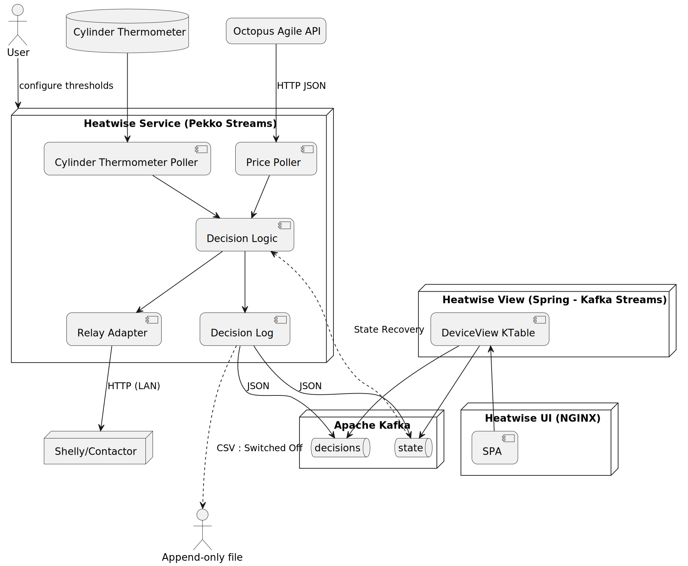

# Heatwise — Idea

## Overview
**Heatwise Immersion** is a lightweight, intelligent controller for an electric immersion heater (hot-water tank spiral).  
It automatically schedules heating to run during **low electricity price periods** using **Octopus Agile** data, helping to reduce energy costs and carbon footprint.

## Concept
The system continuously monitors:
- **Agile half-hour electricity prices** from the Octopus Energy API
- (Optionally) **local water temperature** from a sensor or smart relay with metering

Based on configurable thresholds and timing rules, it decides when to switch the **immersion heater ON or OFF**.  
Control happens through a **Wi-Fi relay** (e.g., Shelly Pro or Sonoff) that operates a **contactor coil**—the contactor itself switches the 3 kW heating element safely.

## Goals
- **Cost optimization:** Use cheaper Agile slots automatically.
- **Convenience:** Maintain sufficient hot water by a chosen “ready-by” time.
- **Simplicity:** No cloud dependencies, everything runs locally or in a small container.
- **Safety:** The tank’s built-in thermostat remains the final temperature control.
- **Observability:** Expose health, readiness, and Prometheus-compatible metrics for monitoring.

## Typical Flow
1. Fetch current and upcoming Agile prices.
2. Decide if heating is economically and operationally justified.
3. Command the Wi-Fi relay to energize or cut power to the immersion contactor.
4. Record each decision for transparency and analysis.

## Intended Users
- Homeowners or tinkerers with **Octopus Agile tariffs**.
- People running **smart energy setups** (Home Assistant, Raspberry Pi, or Kubernetes).
- Developers or engineers exploring **event-driven control** of IoT energy devices.

## Vision
A simple, open-source controller demonstrating that **data-driven energy efficiency** can be achieved with clear logic, minimal hardware, and full local autonomy—no vendor lock-in.

